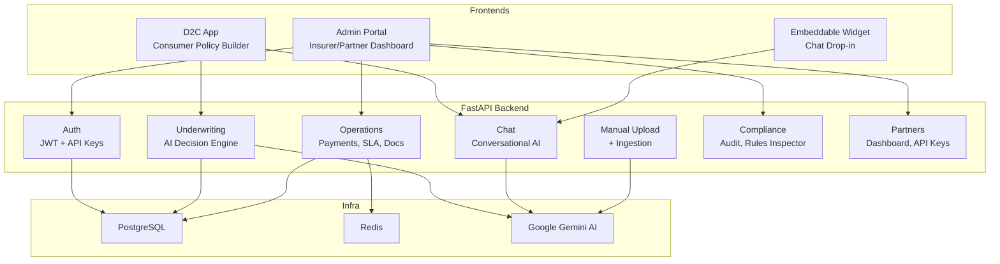

# InsurBridge AI — Project Overview

## What It Aims to Achieve

InsurBridge AI is an **AI-powered insurance infrastructure platform** built for the Heirs Insurance hackathon. The core idea is "**Liquid Logic**" — uploading underwriting manuals (PDF/TXT), having Gemini AI compile them into deterministic JSON rulesets, and then using those rules to make instant underwriting decisions.

The platform serves **three user types** through three separate frontends:

| User                          | Frontend               | Purpose                                              |
| ----------------------------- | ---------------------- | ---------------------------------------------------- |
| **Consumer**                  | D2C App (`:3000`)      | Browse coverage blocks, build a policy, chat with AI |
| **Partner** (banks, fintechs) | Admin Portal (`:3002`) | Dashboard, commissions, API key management           |
| **Insurer / Compliance**      | Admin Portal (`:3002`) | SLA monitoring, audit logs, rules inspection         |
| **Any website**               | Widget (`:3001`)       | Embeddable chatbot for insurance Q&A                 |



---

## Where It Is At (Current State)

### ✅ What's Working

| Component                           | Status        | Notes                                                     |
| ----------------------------------- | ------------- | --------------------------------------------------------- |
| **Auth** (register, login, JWT)     | ✅ Working    | Partners, insurers, consumers, compliance roles           |
| **Manual Upload + AI Ingestion**    | ✅ Working    | TXT/PDF → encrypted storage → Gemini compilation          |
| **AI Underwriting** (`/underwrite`) | ✅ Working    | Routes to product manual, LLM makes decisions             |
| **AI Chat** (`/chat`)               | ✅ Working    | General expert + product-specific modes                   |
| **D2C Frontend**                    | ✅ Builds     | Hero, PolicyBuilder, CoverageSelector, ChatBot            |
| **Admin Portal**                    | ✅ Builds     | Login, role-based dashboards, SLA, rules inspector        |
| **Widget**                          | ✅ Builds     | Floating chatbot component                                |
| **Docker Compose**                  | ✅ Defined    | Backend, 3 frontends, PostgreSQL, Redis                   |
| **3 Product Manuals**               | ✅ Seeded     | Life (term), Auto (comprehensive), Gadget (device)        |
| **Payment Processing**              | ⚠️ Scaffolded | Commission splitting logic exists, no gateway integration |
| **SLA Tracking**                    | ⚠️ Scaffolded | Model + dashboard endpoint, no real metrics flowing       |
| **Webhook Dispatch**                | ⚠️ Scaffolded | Register/list endpoints, HTTP dispatch logic              |
| **Document Generation**             | ⚠️ Scaffolded | PDF/DOCX key-facts + SLA report generators                |
| **Batch CSV Export**                | ⚠️ Scaffolded | Legacy export endpoint                                    |

### ⚠️ Known Issues (Recently Fixed)

- **API key loading**: `.env` was not auto-loaded → Fixed via `pydantic_settings` with `env_file=".env"`
- **LLM response format**: `response.content` returns list-of-dicts in newer `langchain-google-genai` → Fixed with `normalize_content()` helper
- **Missing error handling**: `/underwrite` crashed on LLM failures → Added try/except with graceful fallbacks

### 🔴 What's Not Working / Missing

1. **No real payment gateway** — Paystack/Stripe integration is placeholder only
2. **No email notifications** — `emails` is a dependency but not wired up
3. **SLA metrics are empty** — No real data flowing into `SLARecord`
4. **Ingestion needs `normalize_content()`** — [ingestion.py:79](file:///c:/Users/PC/Documents/GitHub/heirs_insurance_hackathon/app/services/ingestion.py#L79) uses `response.content` directly (same list bug)
5. **Widget + D2C not connected to auth** — No login flow for consumers
6. **No tests passing** — Test files exist but aren't maintained
7. **`google.generativeai` deprecation** — Package shows deprecation warning on import

---

## What's Left to Complete

### Critical for Demo / Presentation

- [ ] **Fix ingestion `normalize_content` bug** — Same `response.content` list issue exists in [ingestion.py](file:///c:/Users/PC/Documents/GitHub/heirs_insurance_hackathon/app/services/ingestion.py)
- [ ] **End-to-end D2C flow** — Consumer selects coverage → AI underwrites → shows decision → (mock) payment
- [ ] **Admin portal connected to real data** — Dashboard stats, recent policies, SLA metrics
- [ ] **Deploy with Docker Compose** — Verify all services start and communicate

### Nice-to-Have

- [ ] Chat history persistence (currently in-memory per browser session)
- [ ] Consumer policy lookup / "My Policies" page
- [ ] Partner onboarding flow through portal

---

## Recommendations to Make It More Practical

### 1. Fix the Remaining `normalize_content` Bug

**Impact**: High · **Effort**: 5 min

The same `response.content` list issue we fixed in underwriting also exists in `ingestion.py` line 79. When a new manual is uploaded, the compilation step will crash.

````diff
# ingestion.py line 79
- compiled_json = response.content.replace("```json", "").replace("```", "").strip()
+ raw = response.content
+ if isinstance(raw, list):
+     raw = " ".join(p['text'] if isinstance(p, dict) and 'text' in p else str(p) for p in raw)
+ compiled_json = raw.replace("```json", "").replace("```", "").strip()
````

---

### 2. Add a Real Payment Flow (Paystack)

**Impact**: High · **Effort**: 2-3 hours

The payment model and commission split logic already exist. Wire up [Paystack's API](https://paystack.com/docs/api/):

1. Generate a Paystack payment link after underwriting approval
2. Verify payment via webhook callback
3. Update `Payment.status` to `"success"` and `Policy.status` to `"active"`

---

### 3. Populate SLA Metrics Automatically

**Impact**: Medium · **Effort**: 1 hour

Currently `SLARecord` is never written to. Add automatic tracking:

- Record `quote_response_time` on every `/underwrite` call
- Record `claim_processing_time` when status changes
- Feed this into the existing SLA dashboard

---

### 4. Add Conversation History to Chat

**Impact**: Medium · **Effort**: 1-2 hours

Currently each `/chat` call is stateless — no memory. Add a `session_id` parameter and store messages in Redis:

- Consumer gets contextual follow-ups instead of cold starts
- Agent mode can build up a complete understanding of the case

---

### 5. Consumer Authentication + Policy Dashboard

**Impact**: Medium · **Effort**: 2-3 hours

Let consumers register, view their policies, and track claims:

1. Add a simple signup/login to the D2C app
2. Create a "My Policies" page showing active policies
3. Link underwriting decisions to the consumer's user ID

---

### 6. Migrate Away from Deprecated `google.generativeai`

**Impact**: Low (future-proofing) · **Effort**: 30 min

The `google.generativeai` package shows deprecation warnings. Migrate to the newer `google-genai` SDK, or rely solely on `langchain-google-genai` which wraps it:

```diff
# llm.py — remove direct genai import
- import google.generativeai as genai
- genai.configure(api_key=api_key, transport="rest")
# langchain-google-genai handles configuration internally
```

---

### 7. Add Basic Automated Tests

**Impact**: Medium · **Effort**: 2-3 hours

The `tests/` directory exists but is empty. Add:

- Unit tests for `route_to_product` and `execute_underwriting`
- Integration test for the full `/underwrite` flow
- API test for `/chat` with mocked LLM

---

## Quick Start Commands

```bash
# Start infrastructure
docker-compose up -d db redis

# Run backend
python -m uvicorn app.main:app --reload --port 8000

# Run D2C frontend
cd frontend/d2c && npm install && npm run dev

# Run Portal
cd frontend/portal && npm install && npm run dev

# Run Widget
cd frontend/widget && npm install && npm run dev
```
