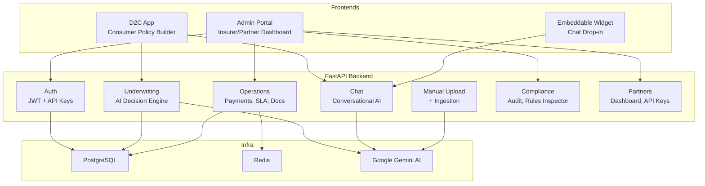

# InsurBridge AI — Project Overview

## What It Aims to Achieve

InsurBridge AI is an **AI-powered insurance infrastructure platform** built for the Heirs Insurance hackathon. The core idea is "**Liquid Logic**" — uploading underwriting manuals (PDF/TXT), having Gemini AI compile them into deterministic JSON rulesets, and then using those rules to make instant underwriting decisions.

The platform serves **three user types** through three separate frontends:

| User                          | Frontend               | Purpose                                              |
| ----------------------------- | ---------------------- | ---------------------------------------------------- |
| **Consumer**                  | D2C App (`:3000`)      | Browse coverage blocks, build a policy, chat with AI |
| **Partner** (banks, fintechs) | Admin Portal (`:3002`) | Dashboard, commissions, API key management           |
| **Insurer / Compliance**      | Admin Portal (`:3002`) | SLA monitoring, audit logs, rules inspection         |
| **Any website**               | Widget (`:3001`)       | Embeddable chatbot for insurance Q&A                 |



---

## Where It Is At (Current State)

### ✅ What Is Implemented and Verified

| Component                           | Status                | Notes                                                               |
| ----------------------------------- | --------------------- | ------------------------------------------------------------------- |
| **Auth** (register/login/JWT/me)    | ✅ Working            | Role-based auth for consumer, partner, insurer, compliance, admin   |
| **Manual Upload + AI Ingestion**    | ✅ Working            | TXT/PDF upload, encrypted storage, compiled rules extraction        |
| **AI Underwriting** (`/underwrite`) | ✅ Working            | Product routing, decisioning, policy creation                       |
| **Agentic Chat** (`/chat`)          | ✅ Working            | Conversational actions + role-specific behavior                     |
| **Payment Flow**                    | ✅ Simulated          | Paystack-style simulation with split logic + activation             |
| **SLA Dashboard/Breaches**          | ✅ Active             | Event-driven `actual_value` + `is_breached` updates now flowing     |
| **D2C Policy History**              | ✅ Authenticated REST | Uses `GET /api/v1/policies/my` (no chat dependency)                 |
| **Portal + Widget**                 | ✅ Working            | Portal auth bootstrap fixed; widget accessibility improved          |
| **Frontend Config Hygiene**         | ✅ Working            | `VITE_API_URL` used across D2C/Portal/Widget                        |
| **Targeted Regression Tests**       | ✅ Passing            | `tests/test_simple.py` + `tests/test_underwriting.py` → `14 passed` |

### ✅ Security & Hardening Highlights

- API error responses no longer leak stack traces.
- JWT and encryption keys are enforced from environment config.
- Startup table creation/seeding is opt-in via environment flags.
- SQL echo/debug behavior is environment-controlled.
- Compliance/audit endpoints now apply tenant scoping for non-admin users.

### ⚠️ Remaining Gaps (Realistic Next Milestones)

1. **Real payment gateway integration** — still simulation-only (no live settlement).
2. **Notification workflows** — transactional email/SMS pipelines are not wired.
3. **Tenant model maturity** — tenant mapping still relies partly on product conventions in prototype flows.
4. **Broader automated test coverage** — targeted suites pass, but end-to-end coverage remains limited.
5. **LLM SDK future-proofing** — dependency path should be reviewed against deprecation notices.

---

## What’s Next (Production Readiness)

### High Priority

- [ ] Integrate live payment verification callbacks (Paystack/Stripe) and reconciliation jobs.
- [ ] Add robust tenant identity model (first-class tenant entities + FK relationships).
- [ ] Add integration tests for auth + policy + payment + SLA + compliance paths.

### Medium Priority

- [ ] Persist chat sessions/conversation state for continuity.
- [ ] Improve observability (structured logs, metrics, alerting dashboards).
- [ ] Add approval workflows and immutable compliance audit ledger.

---

## Practical Recommendations

### 1. Strengthen tenant isolation model

Use explicit `tenant` tables and foreign keys across policies/manuals/SLA/webhooks rather than inferred mapping from product strings.

### 2. Add E2E role/tenant authorization tests

Cover admin vs insurer vs compliance vs consumer access boundaries for `/compliance/*`, `/sla/*`, and `/policies/my`.

### 3. Productionize payment lifecycle

Move from simulation to webhook-verified payment states, retry logic, and idempotent event handling.

### 4. Harden session/token strategy

Migrate from demo `localStorage` usage to HttpOnly cookies + refresh-token rotation in production.

### 5. Expand observability and audit integrity

Add immutable audit records, request IDs, and operational metrics dashboards.

---

## Quick Start Commands

```bash
# Start infrastructure
docker-compose up -d db redis

# Run backend
python -m uvicorn app.main:app --reload --port 8000

# Run D2C frontend
cd frontend/d2c && npm install && npm run dev

# Run Portal
cd frontend/portal && npm install && npm run dev

# Run Widget
cd frontend/widget && npm install && npm run dev
```
